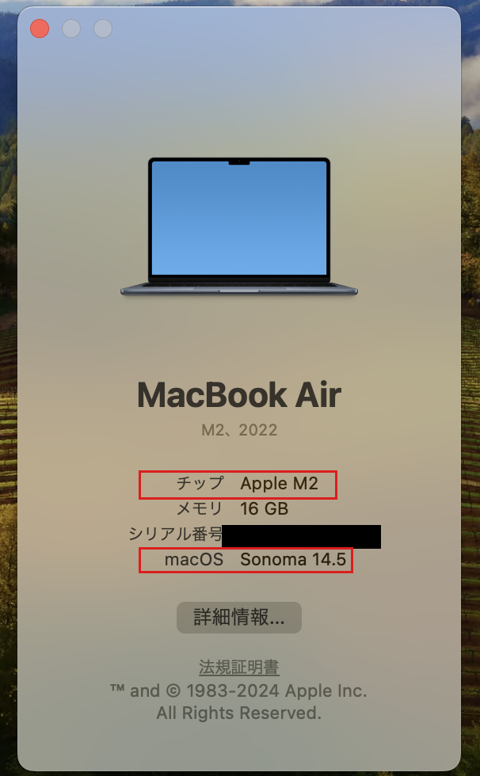
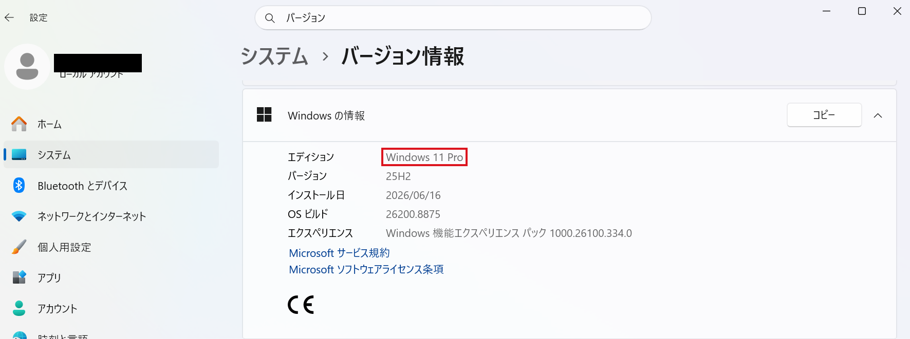

# 01. はじめに

## この手順書の目的

このドキュメントを最後まで進めると、インターン当日に必要な**開発環境**（プログラムを書いて動かすための道具一式）がすべて揃った状態になります。

具体的には、下記の状態を目指します:

- 開発ツール（Docker / .NET / VSCode）がPCに入っている
- 各ツールがちゃんと動くことを Hello World レベルで確認できている

---

## 事前に確認しておいてほしいこと

作業を始める前に、以下を確認してください。

### 1. お使いのPCの環境

| 項目 | 確認方法 |
|-----|---------|
| OSの種類（Windows / Mac） | 「設定」から確認できます |
| OSのバージョン | Windowsなら「バージョン情報」、Macなら「このMacについて」 |
| 空きストレージ容量 | 開発ツール一式（Docker Desktop / .NET SDK / VSCode）のインストールでそれなりに容量を使います。空きに余裕があるか確認してください |
| インターネット接続 | 各種ツールのダウンロードで数GB使います |

**サポート対象**:
- Windows 11
- macOS Sonoma (14) 以降（Apple Silicon / Intel 両対応）





### 2. 管理者権限

いくつかのツールのインストールで、**PCの管理者権限**が必要になります。

- ご自身のPCの場合 → 通常あなたが管理者なので問題ありません
- 大学・会社から支給されたPCの場合 → 管理者権限がないと詰まる場合があります。事前に確認してください

### 3. 時間の見積もり

- 通しで **約1〜1.5時間** を見ておいてください
- ダウンロードに時間がかかるステップがあります（Wi-Fi推奨）
- 一気にやらずに、途中で休憩を挟んで大丈夫です

---

## 進め方のコツ

### コピペを活用しよう

このドキュメントでは、以下のような「グレーの背景の枠」の中にコマンドを書いています:

```output
これがコマンドです
```

そのままコピーしてターミナル（後で説明します）に貼り付けて実行できます。**打ち間違いを防ぐためにも、自分でタイプするよりコピペが確実**です。

### エラーはつきもの、むしろヒント

初めての環境構築では、どこかで必ずエラーに遭遇します。エラーメッセージは「どこで何が起きたか」を教えてくれる**手がかり**なので、まず内容を読み解いてみましょう。

1. エラーメッセージを**そのままコピーしてGoogle検索**する
2. 本手順書の [§06 トラブルシューティング](./06-トラブルシューティング.md) を確認する
3. どうしても解決しない場合は、**インターン当日は早めに来てスタッフと一緒にセットアップする時間**を設けているので、そこで一緒に解決しましょう

### まず動かす、理解は後回しでOK

「なぜこのコマンドが必要なのか？」を全部理解しようとすると、環境構築だけで丸1日かかってしまいます。まずは**手順通りに動かして**、後から興味のあるところを深掘りするスタイルがおすすめです。

「これは何？」と気になったツールは、当日プログラムの合間や、終わってから調べてみてください。

---

## 用意しておくと便利なもの

- **メモアプリ**（インストール中に控えておきたい情報がある場合）
- **PDFビューア**（この手順書自体もPDFで配布される予定）
- 時間に余裕を持ったスケジュール

---

準備ができたら、次は [§02 用語とツールの基礎知識](./02-用語とツールの基礎知識.md) に進んでください。

プログラミング初心者向けに、ターミナルの使い方などを説明しています。既に知っている方は読み飛ばして構いません。
