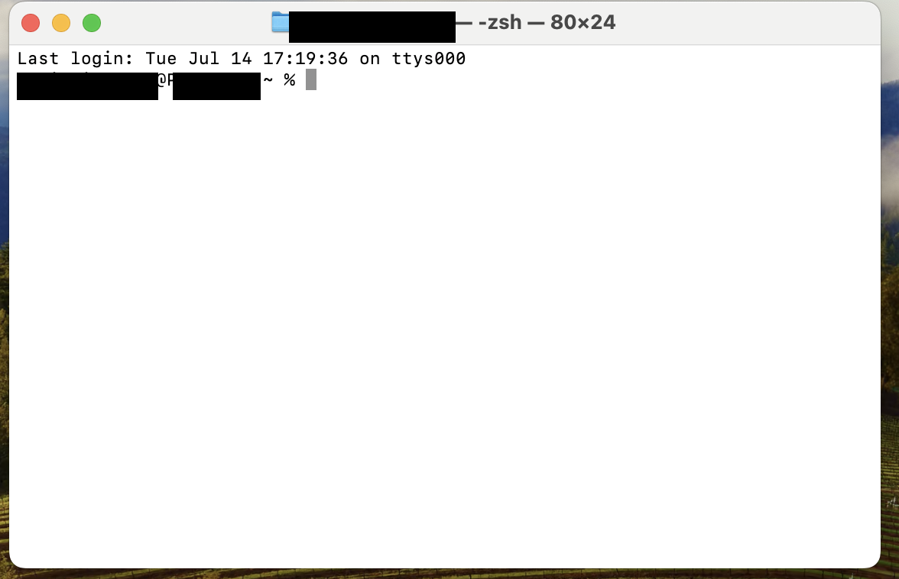

# 02. 用語とツールの基礎知識

このセクションでは、これから何度も出てくる**用語**と、**基本ツール（ターミナル）の使い方**を説明します。

**すでに知っている項目は、読み飛ばして構いません。**

---

## ターミナルってなに？

**ターミナル**は、キーボードから文字でPCに命令するための画面です。環境によっては「コマンドプロンプト」「PowerShell」「シェル」「コンソール」などとも呼ばれます。

マウスでアイコンをダブルクリックする代わりに、文字でコマンドを入力してPCに指示します。

**使用するメリット**:

- GUI が用意されていない開発ツールも操作できる
- 定型作業はコマンド1つで完了するため、GUI 操作より速く・正確に実行できる場面が多い

---

## ターミナルの起動方法

### Windows の場合

**「PowerShell」というアプリを使います。**

1. キーボードの **Windowsキー** を押す
2. `powershell` と入力
3. 「Windows PowerShell」が候補に出るので、それを選ぶ
4. 黒（または青）い画面が開きます

### Mac の場合

**「ターミナル.app」というアプリを使います。**

1. `Cmd` + `Space` キーを同時押しして、Spotlight（検索窓）を開く
2. `terminal` または `ターミナル` と入力
3. 「ターミナル」が候補に出るので、Enter で開く
4. 白（または黒）い画面が開きます

タブやウィンドウを閉じてしまっても、同じ手順で開き直せます。

---

## ターミナルの見方

ターミナルを開くと、以下のような画面が表示されます:

```output
student@MacBook-Pro ~ %
```

Windows の場合:

```output
PS C:\Users\student>
```

このように表示された状態を **プロンプト** と呼び、コマンド入力を受け付けていることを示します。末尾の `%` や `>` は入力位置の目印です。



- カーソルは `%` や `>` の右側に表示されます
- そこにコマンドを入力して **Enter キーを押す** と実行されます

### 実際にやってみる（安全なコマンド）

ためしに、以下を入力して Enter を押してみてください:

```
echo hello
```

`hello` と表示されれば成功です。これは「echo」というコマンドで「hello」という文字を表示させました。

---

## コマンドの構造

コマンドは**スペース区切り**の要素で構成されます。

例:
```output
dotnet build --configuration Release
```

各要素の意味:
- `dotnet` … コマンド名（.NET SDK を呼び出す）
- `build` … サブコマンド（実行する処理を指定）
- `--configuration Release` … オプション（`--<名前> <値>` の形式で動作を指定）

`--` から始まる要素は **オプション** と呼び、コマンドの動作を細かく指定するために使います。

### 注意点

- **大文字・小文字は記載通りに入力してください**（環境によって区別の扱いが異なるため、書かれた通りに入力するのが確実です）
- **スペースは半角1つ**で区切ります（余計なスペースは入れない）
- **全角スペースは使えません**（見た目は同じでも、別の文字として扱われます）

---

## コピペのやり方

このドキュメントに載っているコマンドは、そのままターミナルにコピペして使えます。

### Windows

- **コピー**: ブラウザやドキュメント上で文字を選択 → `Ctrl + C`
- **ターミナルに貼り付け**: `Ctrl + V` または `右クリック`
- **ターミナル内でコピー**: 文字を選択 → `Ctrl + Shift + C`（通常のCtrl+Cはコマンドを中断する意味になるので注意）

### Mac

- **コピー**: ブラウザやドキュメント上で文字を選択 → `Cmd + C`
- **ターミナルに貼り付け**: `Cmd + V`
- **ターミナル内でコピー**: 文字を選択 → `Cmd + C`

---

## よく使うコマンドの紹介

インターンでよく出てくる基本コマンドをまとめておきます。**今すぐ覚える必要はありません**、必要なときにここに戻って確認すればOK。

| コマンド | 意味 | 例 |
|---------|-----|----|
| `cd` | change directory の略。指定したフォルダに移動する | `cd Documents` |
| `mkdir` | make directory の略。新しいフォルダを作る | `mkdir myfolder` |
| `echo` | 続けて書いた文字を出力する。設定ファイルへの追記にも使う | `echo hello` |
| `docker` | Dockerを操作するコマンド | `docker compose up` |
| `dotnet` | .NETを操作するコマンド | `dotnet run` |

---

## フォルダ移動（cd）

ターミナルには「現在のフォルダ」という概念があります。`cd` コマンドで別のフォルダに移動します。

### ホームフォルダに移動

```
cd ~
```

`~`（チルダ）はホームフォルダを指す略記号です（Windows PowerShell では `$HOME` も使用できます）。

### 特定のフォルダに移動

```
cd dotnet-test
```

現在のフォルダ内にあるフォルダ名を指定すると、そのフォルダに入ります。

---

## PATH（パス）とは

**PATH** は、OS が実行ファイルを検索する対象フォルダのリストを保持する環境変数です。コマンド名（例: `dotnet`）を入力すると、OS は PATH に登録されたフォルダを順番に検索し、該当する実行ファイルを起動します。

「PATH が通っていない」とは、ツールをインストール済みであっても、その実行ファイルが PATH 上に見つからない状態を指します。具体的には、以下のようなエラーメッセージが表示されます:

- **Windows (PowerShell)**: `'dotnet' は、コマンドレット、関数、スクリプト ファイル、または操作可能なプログラムの名前として認識されません。`
- **Windows (コマンドプロンプト)**: `'dotnet' は、内部コマンドまたは外部コマンド、操作可能なプログラムまたはバッチ ファイルとして認識されていません。`
- **Mac (zsh)**: `zsh: command not found: dotnet`

対処方法は [§06 トラブルシューティング](./06-トラブルシューティング.md) を参照してください。

インストーラは通常 PATH を自動で設定するため、手動設定は基本的に不要です。

---

## 管理者権限とは

**管理者権限** は、システム全体に影響する操作（ソフトウェアのインストール、システム設定の変更など）を実行するために必要な権限です。OS はこれらの操作を実行する前に、管理者権限の確認を求めます。

- Windows: 「ユーザーアカウント制御 (UAC)」のダイアログが表示されます。**「はい」**を選択してください
- Mac: パスワードの入力を求められます。**PC ログイン時のパスワード**を入力してください

---

## ここまで読めば準備OK

用語の基礎知識はこれで十分です。実際のインストール手順に進みましょう。

**Windowsの方は** → [§03 環境構築 - Windows](./03-環境構築-Windows.md)

**Macの方は** → [§04 環境構築 - Mac](./04-環境構築-Mac.md)

途中で用語がわからなくなったら、いつでもこのページに戻ってきてください。
