# 03. 環境構築 - Windows

> 🪟 **この章は Windows の方向けです。** Mac をお使いの方は、この章を飛ばして **§04（環境構築 - macOS）** へ進んでください。

Windows 11 での環境構築手順です。**上から順番に**進めてください。

**所要時間: 約30分**（ダウンロード時間含む）

---

## インストールする4つのツール

| ツール | 何をするもの？ |
|-------|--------------|
| ① WSL2 | Docker Desktop の動作に必要な仕組み |
| ② Docker Desktop | データベース（MySQL）を動かす |
| ③ .NET 10 SDK | Web API プログラムを動かす |
| ④ Visual Studio Code + 拡張機能 | ソースコードを書くエディタ |

---

## ① WSL2 の有効化

WSL2（Windows Subsystem for Linux 2）は、Docker Desktop が内部的に使う仕組みです。まずこれを有効にします。

### 手順

1. **PowerShell を管理者権限で起動する**（以下のどちらでもOK）:
   - スタートメニュー右クリック → **「ターミナル (管理者)」** を選ぶ
   - もしくは、スタートメニューを開いて `powershell` と検索 → 右側の **「管理者として実行」** をクリック
   - 「ユーザーアカウント制御」が出たら **「はい」** をクリック

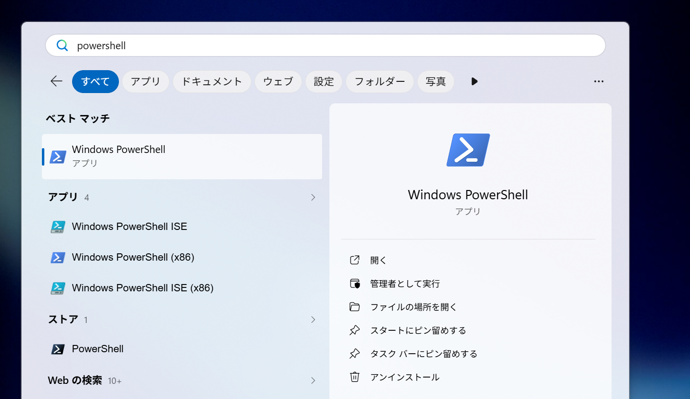

2. 開いた PowerShell に、以下のコマンドを貼り付けて Enter:

```
wsl --install
```

3. インストールが始まります。**5〜10分ほどかかります**
4. 完了したら、**PCを再起動** してください
  
5. 再起動後、Ubuntu の初期設定画面が自動で開くことがあります。もし開いたら
   - **ユーザー名とパスワード**を聞かれるので、任意のもの（覚えやすいもの）を入力
   - パスワードは入力しても画面に表示されません。これは仕様です

### 確認

再度 PowerShell を開いて、以下を実行:

```
wsl --status
```

「既定のバージョン: 2」と表示されていれば OK。


---

## ② Docker Desktop のインストール

### 手順

1. 公式サイトを開く: [https://www.docker.com/products/docker-desktop/](https://www.docker.com/products/docker-desktop/)
2. **「Docker Desktop をダウンロード」** の右のプルダウンから **「Windows 版のダウンロード – AMD64」** を選ぶ

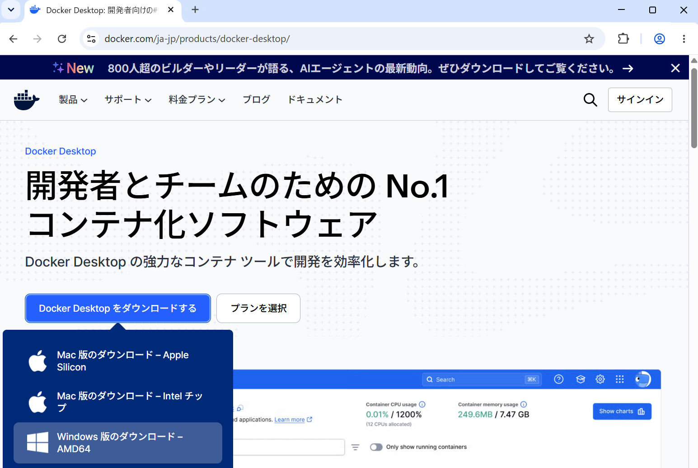

3. ダウンロードした `Docker Desktop Installer.exe` をダブルクリック
4. 「ユーザーアカウント制御」が出たら **「はい」**
5. インストーラの設定画面が出ます:
   - **「Per-user installation (Recommended)」** を選ぶ（管理者権限不要）
   - **「Use WSL 2 instead of Hyper-V」にチェック**（デフォルトでチェック済みのはず）
   - 「Add shortcut to desktop」もチェック推奨

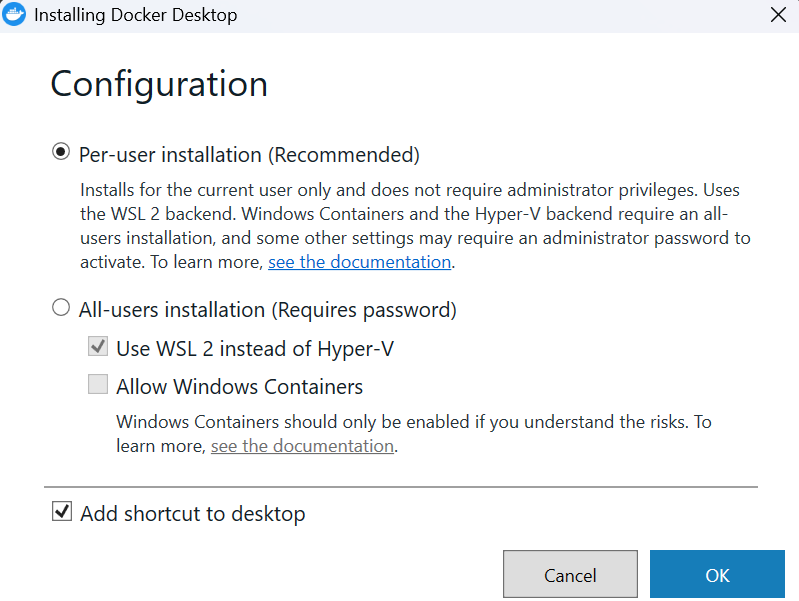

6. **「Ok」** をクリック → インストール開始
7. 完了したら **「Close」** を押す

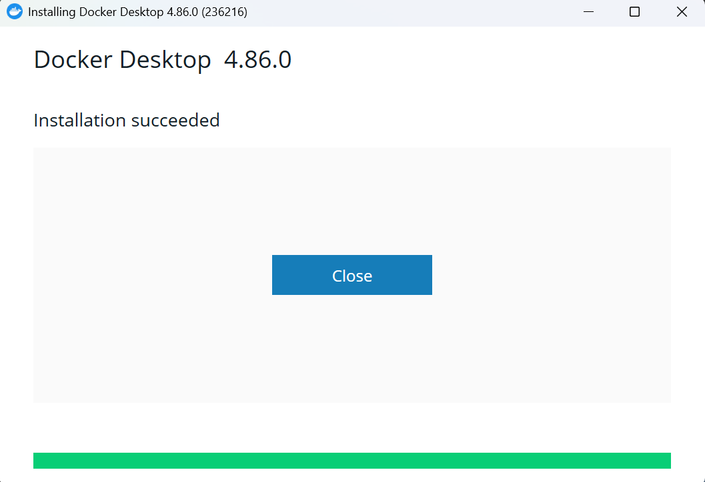

### 初回起動

1. デスクトップの **Docker Desktop アイコン** をダブルクリックで起動
2. サービス利用規約が出るので **「Accept」**
3. 「Sign in」画面が出ますが、右上の **「Skip」** リンクでスキップしてOK（アカウント作成不要）

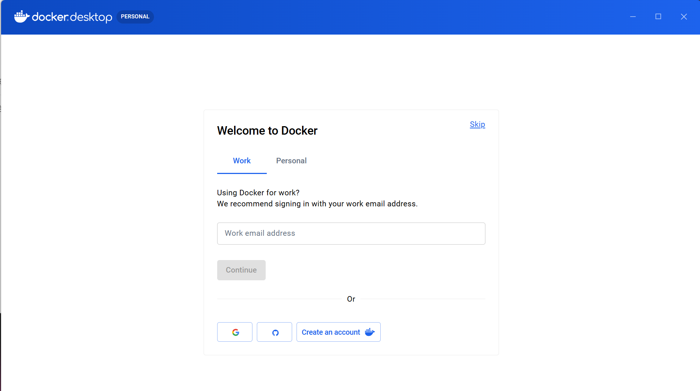

4. しばらく待つと、Docker Desktop のダッシュボード画面が開きます
5. 画面左下の Engine アイコンが**緑色（Engine running）**になれば準備完了

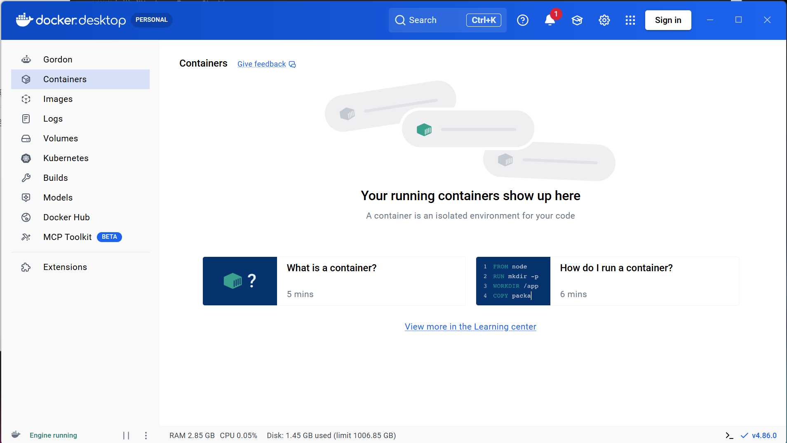

### 確認

> ⚠️ **PowerShell は必ず開き直してください**。Docker Desktop のインストーラは自動サインアウトや PC 再起動をしないため、**インストール前から開いていた PowerShell は古い PATH のまま**で `docker` コマンドが「認識されません」エラーになります。開き直しでも直らなければ PC ごと再起動してみてください。

**新しく開いた PowerShell** で以下を実行:

```
docker --version
```

何か数字（バージョン）が出ればOK! 例: `Docker version 27.5.1`。


続けて:

```
docker compose version
```

何か数字（バージョン）が出ればOK! 例: `Docker Compose version v2.34.0`。


---

## ③ .NET 10 SDK のインストール

### 手順

1. 公式ダウンロードページを開く: [https://dotnet.microsoft.com/download/dotnet/10.0](https://dotnet.microsoft.com/download/dotnet/10.0)
2. **「アプリのビルド - SDK」** セクションの **Windows** 行 → **「x64」** のインストーラをクリック

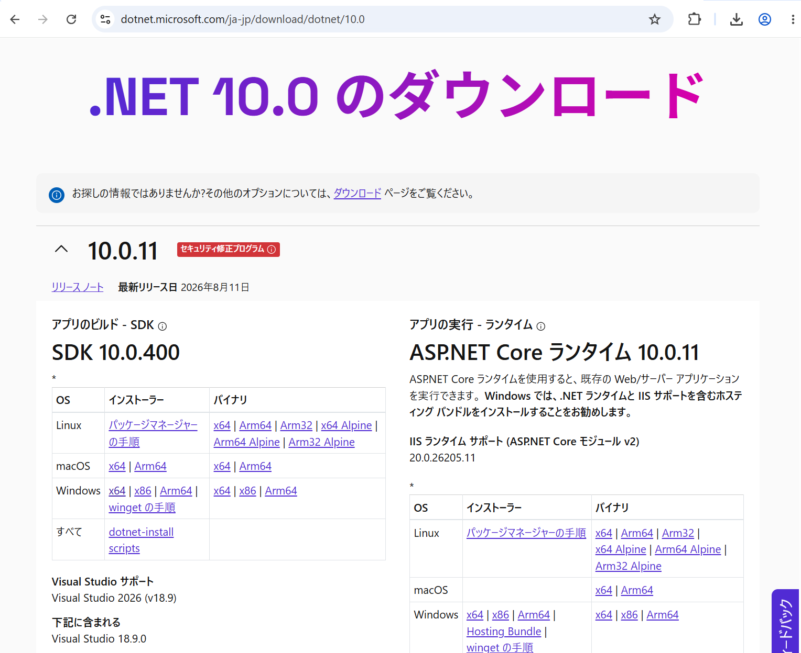

3. ダウンロードした `.exe` を実行
4. 「ユーザーアカウント制御」が出たら **「はい」**
5. インストーラで **「インストール」** を押す

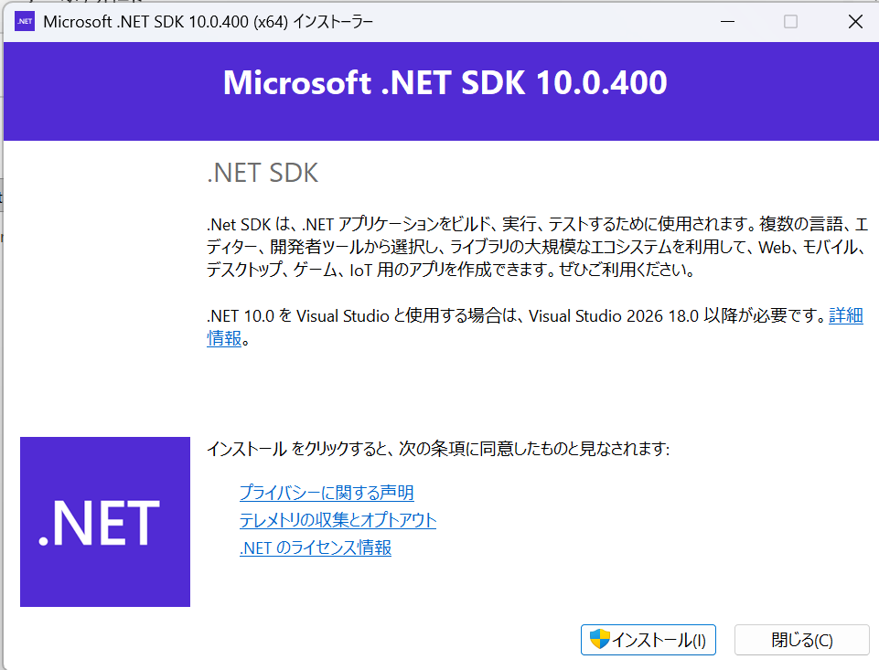

6. 完了したら **「閉じる」**

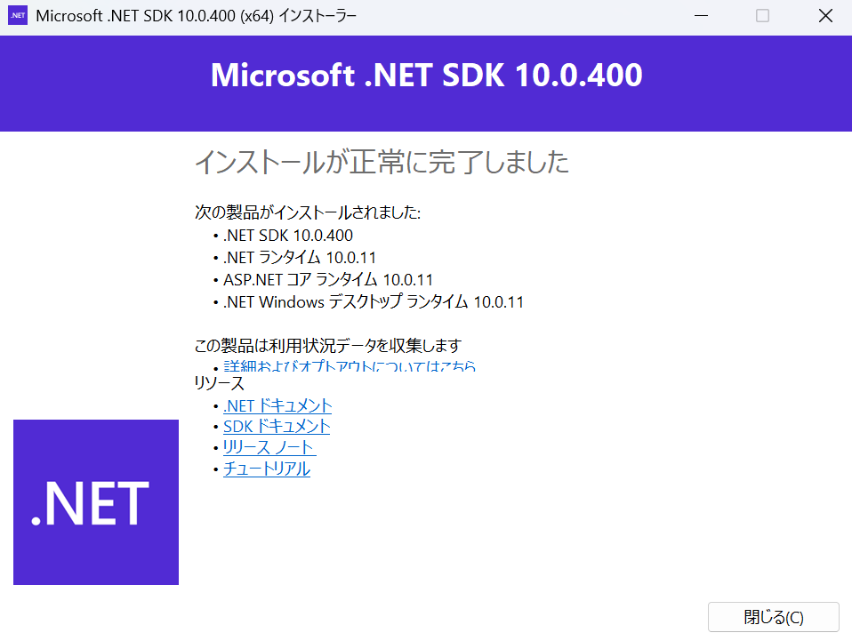

### 確認

**PowerShell を新しく開き直して**、以下を実行:

```
dotnet --version
```

先頭が `10.` なら OK。例: `10.0.100`。


**注意**: PowerShell を開き直さないと、新しくインストールしたコマンドが認識されません。既存のウィンドウは閉じて、新しく開いてください。

---

## ④ Visual Studio Code + C# Dev Kit

### VSCode のインストール

1. 公式サイトを開く: [https://code.visualstudio.com/](https://code.visualstudio.com/)
2. 「Download for Windows」をクリック
3. ダウンロードした `.exe` を実行
4. インストーラの **「追加タスクの選択」** 画面で:
   - **「エクスプローラーのファイル コンテキストメニューに [Code で開く] アクションを追加する」にチェック**
   - **「エクスプローラーのディレクトリ コンテキストメニューに [Code で開く] アクションを追加する」にチェック**
   - **「PATH への追加」にチェック**（デフォルトでチェック済み）

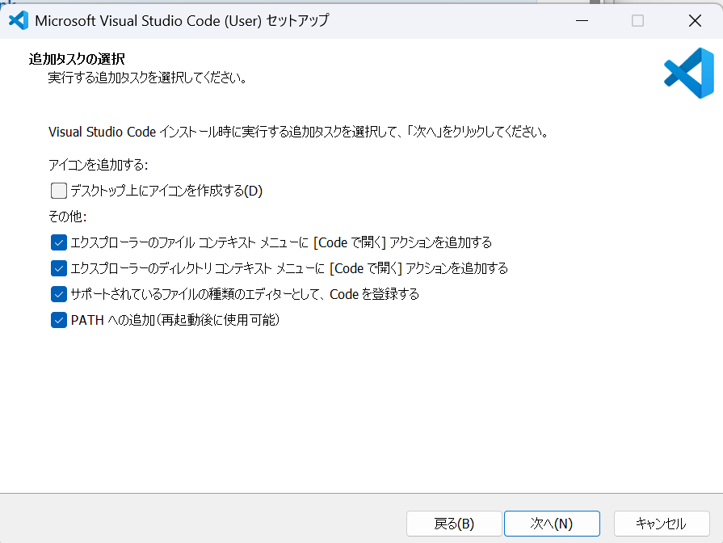

5. 「次へ」→「インストール」→「完了」

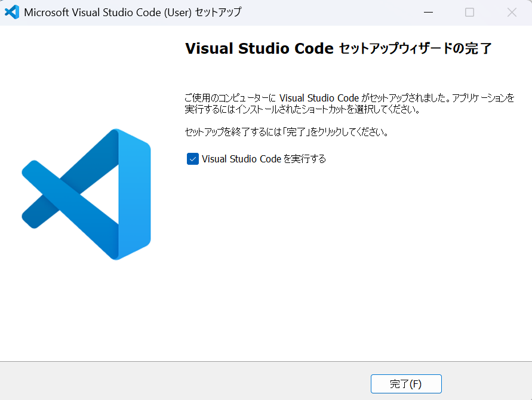

### C# Dev Kit 拡張機能のインストール

1. VSCode を起動
2. 左端の **四角い積み木のアイコン**（拡張機能）をクリック
3. 検索窓に `C# Dev Kit` と入力
4. **「C# Dev Kit」**（Microsoft製）の **Install** ボタンをクリック
5. 依存関係にある **「C#」拡張機能** も自動で入ります

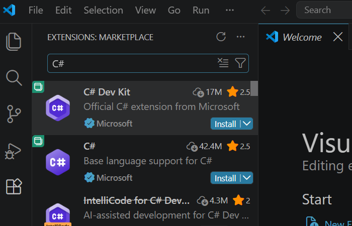

### 動作確認

VSCode を開いて、`Ctrl + @` （バッククォート）でVSCode内蔵のターミナルを開いてみてください。ここでも `dotnet --version` などが動けばOK。

> ⚠️ **VSCode 内蔵ターミナルで `docker --version` だけ「認識されません」と出る場合があります**（通常の PowerShell では動くのに、という状況）。これは Windows の仕組み上、VSCode がインストール前の古い PATH 情報を引き継いでしまうためです。**PC を再起動**すれば直ります。詳しくは [§06 トラブルシューティング](./06-トラブルシューティング.md) の「VSCode 内蔵ターミナルで docker が認識されない」を参照。


---

## すべて入ったか最終確認

PowerShell を新しく開いて、以下を1つずつ実行してください。すべて数字（バージョン）が返ればOK:

```
docker --version
```

```
docker compose version
```

```
dotnet --version
```

```
code --version
```

**1つでもエラーが出た場合**は、[§06 トラブルシューティング](./06-トラブルシューティング.md) を確認してください。

---

## 次のステップ

インストールお疲れさまでした。

続いて [§05 動作確認 (Hello World)](./05-動作確認-HelloWorld.md) に進んで、各ツールがちゃんと動くか、Hello World レベルで確認しましょう。
