# 04. 環境構築 - macOS

> 🍎 **この章は Mac の方向けです。** Windows をお使いの方は、この章を飛ばして **§05（動作確認 - Hello World）** へ進んでください（Windows 向け手順は §03 に記載しています）。

macOS での環境構築手順です。**上から順番に**進めてください。

**所要時間: 約30分**（ダウンロード時間含む）

**対応OS**: macOS Sonoma (14) 以降

---

## ご自身のMacが Apple Silicon か Intel かを確認

インストール手順が一部異なるため、まずお使いのMacを確認します。

1. 左上のリンゴマーク 🍎 → **「このMacについて」** を選ぶ
2. 「チップ」または「プロセッサ」の欄を確認:
   - **「Apple M1」「M2」「M3」「M4」など** → Apple Silicon
   - **「Intel Core」など** → Intel Mac


この情報は次の **① Docker Desktop のダウンロード** でチップに応じた版を選ぶ際に使います。

---

## インストールする3つのツール

| ツール | 何をするもの？ |
|-------|--------------|
| ① Docker Desktop | データベース（MySQL）を動かす |
| ② .NET 10 SDK | Web API プログラムを動かす |
| ③ Visual Studio Code + 拡張機能 | ソースコードを書くエディタ |

---

## ① Docker Desktop のインストール

### 手順

1. 公式サイトを開く: [https://www.docker.com/products/docker-desktop/](https://www.docker.com/products/docker-desktop/)

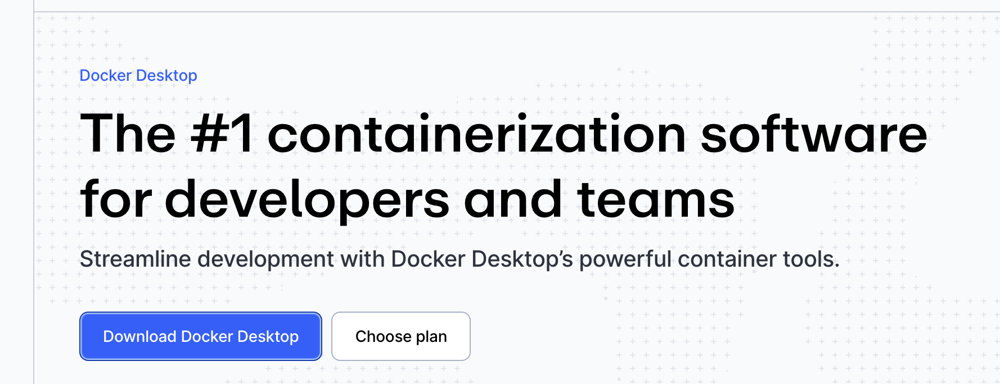

2. **お使いのMacに合わせて**ダウンロード:
   - **Apple Silicon**: 「Download for Mac - Apple Silicon」
   - **Intel Mac**: 「Download for Mac - Intel Chip」

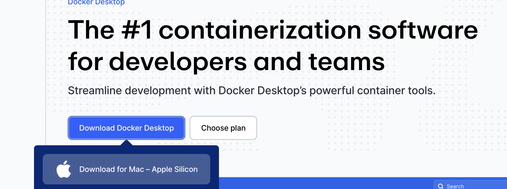

3. ダウンロードした `.dmg` ファイルをダブルクリック
4. Docker のアイコンを **「Applications」フォルダにドラッグ&ドロップ**

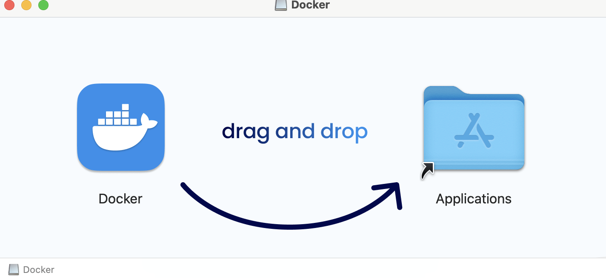

5. Finder を開き、サイドバーの **「アプリケーション」** フォルダを表示
6. **Docker.app** をダブルクリックして起動（Launchpad の **Docker** アイコンからも起動可能）
7. 「"Docker"はインターネットからダウンロードされたアプリケーションです」と出たら **「開く」**

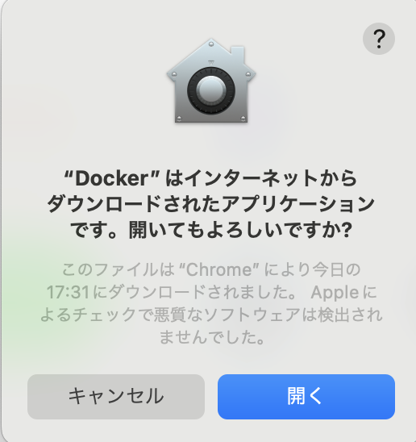

8. パスワードを求められたら入力

### 初回起動

1. サービス利用規約が出るので **「Accept」**
2. 「Recommended settings (requires password)」の画面 → **「Finish」**
3. 「Sign in」画面 → **「Continue without signing in」**（アカウント作成不要）
4. アンケート → **「Skip」**
5. ダッシュボードが開き、画面下部のクジラアイコンが**緑色（Running）**になれば準備完了

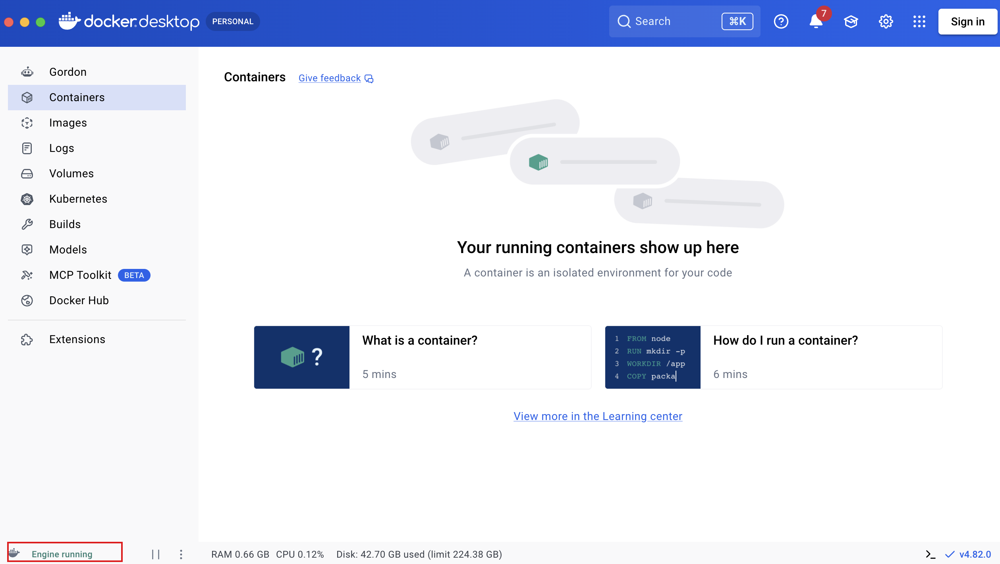

### 確認

ターミナルを開いて:

```
docker --version
```

何か数字（バージョン）が出ればOK! 例: `Docker version 27.5.1`。続けて:

```
docker compose version
```

何か数字（バージョン）が出ればOK! 例: `Docker Compose version v2.34.0`。

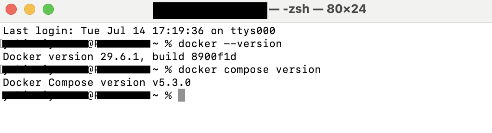

---

## ② .NET 10 SDK のインストール

公式のインストールスクリプトを使ってダウンロード & インストールします。

### 手順

ターミナルに、以下を順に貼り付けて実行してください（**1コマンドずつ**）:

```
curl -sSL https://dot.net/v1/dotnet-install.sh -o /tmp/dotnet-install.sh
```

```
chmod +x /tmp/dotnet-install.sh
```

```
/tmp/dotnet-install.sh --channel 10.0 --install-dir ~/.dotnet
```

**3つ目のコマンド**でダウンロードが始まります（数分かかります）。

### PATH を通す

インストールした `dotnet` コマンドをどこからでも使えるように、以下も実行してください。

**あなたのシェルを確認**:

```
echo $SHELL
```

- 出力が `/bin/zsh` → 以下を1つずつ実行:

```
echo 'export PATH="$HOME/.dotnet:$PATH"' >> ~/.zshrc
```

```
echo 'export DOTNET_ROOT="$HOME/.dotnet"' >> ~/.zshrc
```

```
source ~/.zshrc
```

- 出力が `/bin/bash` → 上記の `~/.zshrc` を `~/.bash_profile` に置き換えて実行

### macOS のセキュリティ許可（重要）

初回に `dotnet` コマンドを実行すると、macOSの**Gatekeeper**という機能が「本当に実行していい？」と警告し、コマンドが**無言で終了する**ことがあります。

もし次のコマンドが **なにも表示せず終了する**、または **エラーメッセージなく戻ってくる**場合:

```
dotnet --version
```

以下の手順で許可してください:

1. アップルメニュー 🍎 → **「システム設定」**
2. 左のリストから **「プライバシーとセキュリティ」**
3. 一番下までスクロール → **「セキュリティ」** セクションを探す
4. **「"dotnet" は開発元を確認できないため使用がブロックされました」** のような表示があるはず
5. その右の **「このまま許可」** ボタンをクリック
6. 再度 `dotnet --version` を実行

> 📷 スクリーンショット: システム設定の「プライバシーとセキュリティ」の「このまま許可」画面

### 確認

```
dotnet --version
```

先頭が `10.` なら OK。例: `10.0.100`。

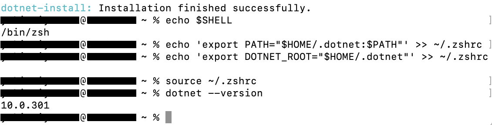

---

## ③ Visual Studio Code + C# Dev Kit

### VSCode のインストール

1. 公式サイトを開く: [https://code.visualstudio.com/](https://code.visualstudio.com/)
2. **「Download for macOS」** をクリック
3. ダウンロードした `.dmg` ファイルをダブルクリック
4. **「Visual Studio Code.app」** を **「アプリケーション」フォルダにドラッグ&ドロップ**
5. Finder を開き、サイドバーの **「アプリケーション」** フォルダを表示
6. **Visual Studio Code.app** をダブルクリックして起動（Launchpad の **Visual Studio Code** アイコンからも起動可能）
7. 「"Visual Studio Code"はインターネットからダウンロードされたアプリケーションです」と出たら **「開く」**

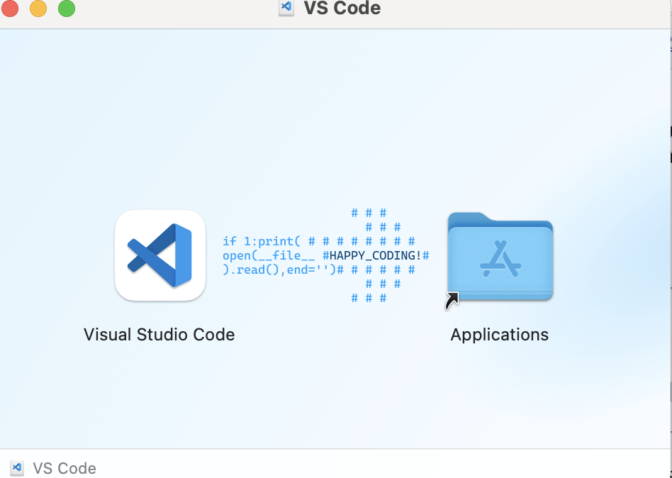

無事に開けたらこんな感じ ↓

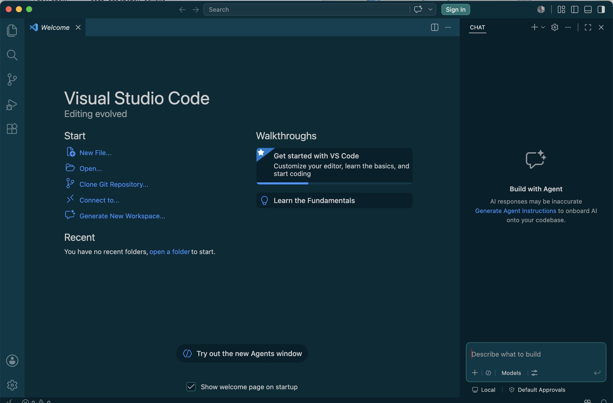

初回起動時のセットアップでカラーテーマを聞かれます。好きな色を選んで **Continue** で進んでください（あとから変更もできます）。

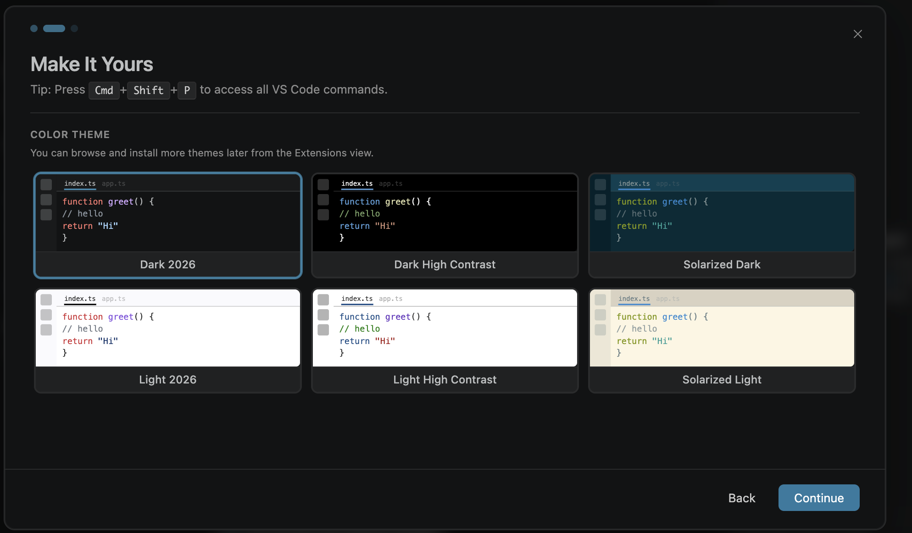

### C# Dev Kit 拡張機能のインストール

1. VSCodeで、左端の **四角い積み木のアイコン**（拡張機能）をクリック
2. 検索窓に `C# Dev Kit` と入力
3. **「C# Dev Kit」**（Microsoft製）の **Install** ボタンをクリック
4. 依存関係にある **「C#」拡張機能** も自動で入ります

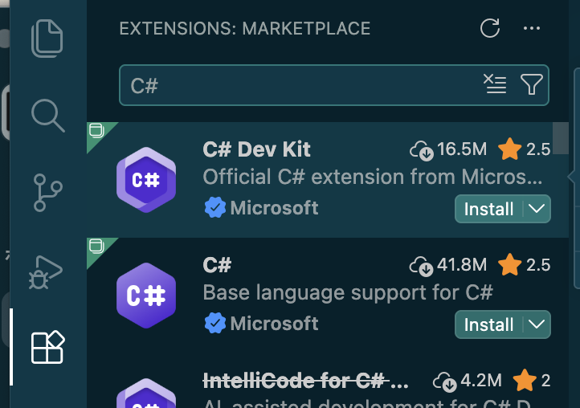

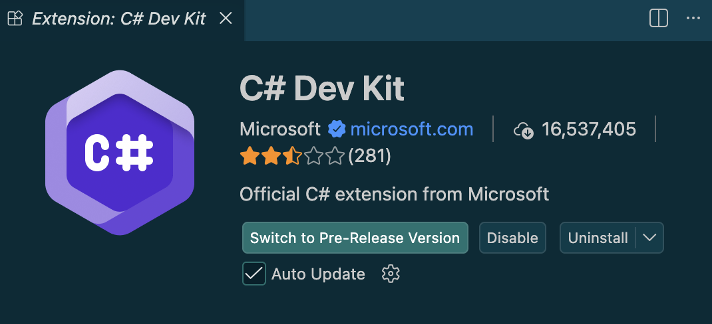

---

## すべて入ったか最終確認

**ターミナルを新しく開いて**、以下を1つずつ実行してください。すべて数字（バージョン）が返ればOK:

```
docker --version
```

```
docker compose version
```

```
dotnet --version
```

**VSCode** はターミナルコマンドではなく、**Launchpad から起動して画面が開くか**で確認します（Macでは `code` コマンドは PATH に登録されていません）。

**1つでもエラーが出た場合**は、[§06 トラブルシューティング](./06-トラブルシューティング.md) を確認してください。

---

## 次のステップ

インストールお疲れさまでした。

続いて [§05 動作確認 (Hello World)](./05-動作確認-HelloWorld.md) に進んで、各ツールがちゃんと動くか、Hello World レベルで確認しましょう。
