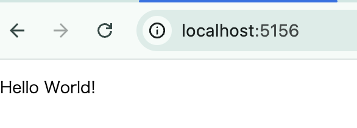
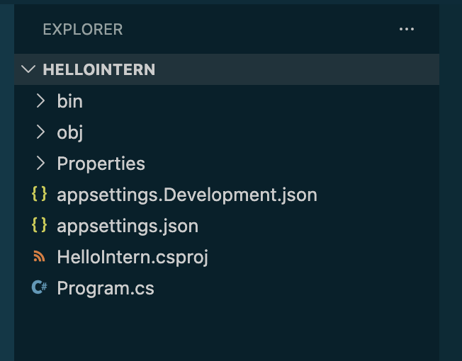
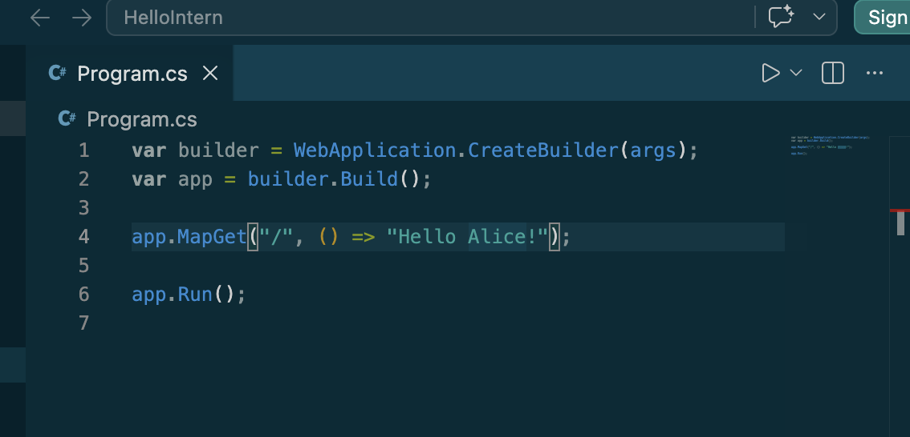
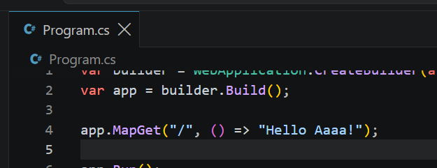

# 05. 動作確認 (Hello World)

環境構築お疲れさまでした。この章では、**インストールした各ツールがちゃんと動くか**、簡単なプログラムを作って確認します。

**所要時間: 15〜20分**

> 💡 **この章はここまでが事前準備の最終ステップ**です。実際のインターン用リポジトリの取得や動作は **インターン当日** に行います。この章の Hello World が動けば、事前準備は完了です。

---

## この章のゴール

- **Docker** が動作する（`hello-world` コンテナ）
- **.NET** で Web API を動かせる（`Hello World!` を返す最小API）
- **VSCode** でソースコードを開ける

上記3つがすべて確認できれば、あなたのPCはインターン当日の準備完了です。

---

## ① Docker の動作確認

Docker が正常にインストールされ、コンテナを起動できるか確認します。

### 1-1. Docker Desktop が起動しているか確認

Docker Desktop が **起動中(Running)** でないと、次のコマンドは失敗します。**まずアイコンで状態を確認**してください。

- **Windows**: 画面右下のタスクトレイ内の **クジラアイコン** が緑色になっているか
- **Mac**: 画面右上のメニューバーの **クジラアイコン** が緑色になっているか

**アイコンが見当たらない / 灰色 / 起動していない場合**:

1. **Windows**: スタートメニューから **Docker Desktop** を起動
2. **Mac**: Launchpad から **Docker** を起動
3. **起動完了まで 1〜2分**ほどかかります（Windowsのコールドブート後は特に）
4. クジラアイコンが**緑色**になるまで待つ


### 1-2. hello-world コンテナを実行

- **Windows**: PowerShell を開く
- **Mac**: ターミナルを開く

以下を実行:

```
docker run hello-world
```

初回はイメージの pull が走ります（数秒〜数十秒）。

### 期待する出力

以下のようなメッセージが表示されればOK:

```output
Hello from Docker!
This message shows that your installation appears to be working correctly.
...
```


うまくいかない場合は [§06 トラブルシューティング](./06-トラブルシューティング.md) を参照。

---

## ② .NET で Hello World API を作る

`Hello World!` と表示するだけのミニマル Web API を、実際に自分の手で作って動かしてみます。

### 手順

#### 1. 作業フォルダに移動

**Windows** (PowerShell):

```
cd $HOME
```

```
mkdir dotnet-test -Force
```

```
cd dotnet-test
```

**Mac** (ターミナル):

```
cd ~
```

```
mkdir -p dotnet-test
```

```
cd dotnet-test
```

#### 2. プロジェクト雛形を作る

以下のコマンドで、最小構成のWeb APIプロジェクトが自動生成されます:

```
dotnet new web -n HelloIntern
```


（Windows PowerShell の場合の例。`cd $HOME` から `dotnet new web` までまとめて実行した画面）


`HelloIntern` フォルダが作られ、その中に必要なファイル一式が生成されます。

```
cd HelloIntern
```

#### 3. 起動する

```
dotnet run
```

初回はコンパイル + パッケージ復元で **30秒〜1分ほど**かかります。**その後、以下のようなメッセージが出れば起動成功**:

```output
Now listening on: http://localhost:5xxx
Application started. Press Ctrl+C to shut down.
```

（`5xxx` は 5000番台のランダムな数字）


#### 4. ブラウザで確認

ブラウザ（Chrome, Edge, Safari など）を開いて、上のログに出ていた URL にアクセス:

```output
http://localhost:5xxx
```

**「Hello World!」** と表示されればOKです。



#### 5. 停止する

ターミナルに戻り、`Ctrl` + `C` を押すと停止します。

**注意**: Mac でも `Command + C` ではなく **`Control + C`** です。


---

## ③ VSCode でコードを開いて改造してみる

VSCode で `HelloIntern` フォルダを開いて、実際に**コードを書き換えて反映されるか**まで確認します。ここまでできれば、「開発ツールで書いたコードが、書き換えた通りに動く」を体感できます。

### 3-1. フォルダを開く

1. VSCode を起動
2. メニューから **File → Open Folder**（Macは **ファイル → フォルダーを開く**）
3. 表示されたダイアログで `dotnet-test` フォルダに入り、`HelloIntern` フォルダをダブルクリックで開いてから **「Select folder」** を押す


初回だけ **「このフォルダー内のファイルの作成者を信頼しますか？」** と聞かれます → **「はい、信頼します」**（Yes, I trust the authors）を選ぶ

> 📷 スクリーンショット: VSCode で HelloIntern を開いた直後の信頼確認ダイアログ



### 3-2. コードを確認する

左サイドバーの `Program.cs` をクリックすると、以下のようなコードが色分けされて表示されます:

```csharp
var builder = WebApplication.CreateBuilder(args);
var app = builder.Build();

app.MapGet("/", () => "Hello World!");

app.Run();
```

### 3-3. コードを書き換えてみる

`"Hello World!"` の**中の文字だけ**を、あなたの名前や好きな文字に変えてみましょう。

たとえば:

```csharp
app.MapGet("/", () => "Hello, Alice!");
```



**⚠️ 注意**:
- ダブルクォート `"..."` は消さない（消すとエラーになります）
- 中身の文字だけ変える
- 全角スペースを混ぜないよう注意（§02の「気をつけること」参照）

### 3-4. 保存する

- **Windows**: `Ctrl` + `S`
- **Mac**: `Cmd` + `S`

保存できると、VSCodeのタブに付いていた **● (点)** が **×** に変わります。この点が「未保存の変更あり」の印です。




### 3-5. サーバーを再起動する

コードの変更を反映させるには、`dotnet run` を再起動する必要があります。

1. **②で `dotnet run` を停止していない場合**: ターミナルで `Ctrl + C` を押して停止
2. ターミナルで再度実行:

```
dotnet run
```

（さっきの `HelloIntern` フォルダにいる状態で実行してください）

### 3-6. ブラウザでリロード

ブラウザに戻り、`http://localhost:5xxx` を開いているタブで **リロード** (再読み込み) します:

- **Windows**: `F5` または `Ctrl + R`
- **Mac**: `Cmd + R`

**書き換えた文字が表示されればOKです。**


### 3-7. サーバーを止める

確認できたら、ターミナルに戻って `Ctrl + C` で停止しておきましょう。

---

### うまく動かない場合

- **`error CS1002` などのエラーで起動失敗** → ダブルクォートやセミコロンを削ってしまっている可能性。§05 の 3-2 のコードと見比べて修正
- **リロードしても古い文字のまま** → `dotnet run` を再起動できていない可能性。ターミナルに `Now listening on...` の再表示が出ているか確認
- どうしても直らなければ、`HelloIntern` フォルダを削除して [§05 ②](#-net-で-hello-world-api-を作る) からやり直しできます

---

## 事前準備完了チェック

以下がすべて Yes なら、事前準備は完了です。

- [ ] `docker run hello-world` が「Hello from Docker!」と表示される
- [ ] `dotnet run` した後、ブラウザに `Hello World!` が表示される
- [ ] VSCode で Program.cs を書き換えて保存、`dotnet run` 再実行→リロードで、書き換えた文字が表示される

**インターン当日は、この状態を前提にスタートします。当日は、実際のインターン用リポジトリの取得から始めるので、お楽しみにしていてください。**

---

## お片付け（任意）

`dotnet-test` フォルダは、動作確認のためだけの一時的なフォルダです。インターン当日は使いません。

削除しても構いませんし、他の .NET 学習用として残しておいても構いません。お好みで。

---

## うまくいかなかったら

[§06 トラブルシューティング](./06-トラブルシューティング.md) を確認してください。それでも解決しない場合でも大丈夫、**インターン当日は早めに来てスタッフと一緒にセットアップする時間**を設けています。

当日は以下を伝えていただけると解決が早くなります:

- お使いのOS（Windows 11 / macOS Sonoma など）
- **エラーメッセージの全文**（スクリーンショット付きだとなおよし）
- どの手順で発生したか（例: 「§05 の `dotnet run` で失敗した」）
