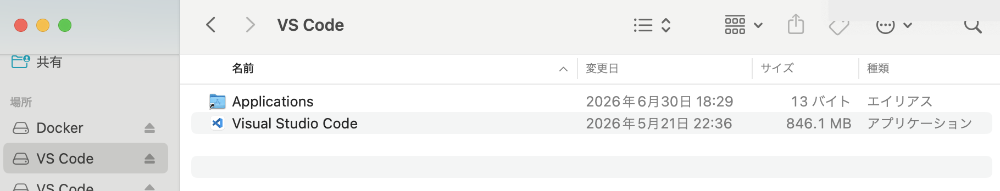
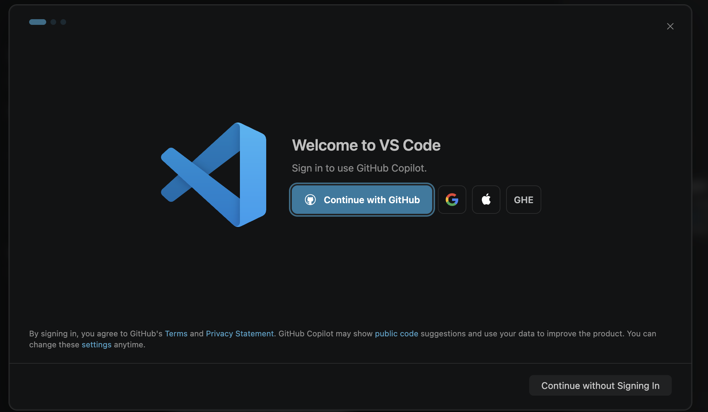

# 06. トラブルシューティング

環境構築中や動作確認中に起きがちなトラブルと、その解決方法をまとめました。

**エラーが出たら、まずここを検索**してみてください（`Ctrl+F` / `Cmd+F` で検索できます）。

> 📌 このページは **事前準備（インストール + Hello World動作確認）** の範囲でのトラブル解説です。インターン当日のリポジトリ操作等で起きたトラブルは、当日のスタッフへどうぞ。

---

## Docker関連

### Docker Desktop が起動しない / クジラアイコンが緑にならない

#### Windowsの場合

**原因1: WSL2 が正しく有効化されていない**

PowerShell を管理者として開いて:

```
wsl --status
```

「既定のバージョン: 2」と出るか確認。出ない場合:

```
wsl --set-default-version 2
```

その後、Docker Desktop を再起動。

**原因2: BIOSで仮想化が無効になっている**

一部の古いPCや、企業支給PCで発生。**タスクマネージャー → パフォーマンス → CPU** を開き、「仮想化: 有効」となっているか確認。

「無効」の場合はBIOS設定変更が必要ですが、これは支給元のIT部門に相談してください（勝手にBIOS設定を触るのはNG）。

**原因3: Docker Desktop 自体の異常**

Docker Desktop を完全終了して起動し直し:

1. タスクトレイのクジラアイコンを右クリック → **Quit Docker Desktop**
2. しばらく待つ（30秒程度）
3. Docker Desktop を再起動

改善しない場合は、Docker Desktop の設定画面右上の **⚙ Settings → Troubleshoot → Reset to factory defaults** で初期化を試す。

#### Macの場合

**原因1: Docker Desktop がインターネットからブロックされている**

「システム設定 → プライバシーとセキュリティ」で、Dockerに関する許可が要求されていないか確認。

**原因2: リソース不足**

Docker Desktopの設定画面 → **Resources** で、メモリ4GB以上・ディスク容量20GB以上を割り当てているか確認。

---

### `docker run hello-world` でイメージダウンロードが遅い / 失敗する

- **ネットワーク回線を確認**（テザリング等で低速だと厳しい）
- **会社/大学のプロキシ環境**にいる場合: Docker Desktopの設定 → **Proxies** でプロキシ設定が必要な場合あり
- Docker Hub にログインしていないと、pull制限（1時間あたり100回）にかかることがあります（初日でここに達することは通常ないですが）

---

### `Cannot connect to the Docker daemon` / `error during connect` エラー

**原因**: Docker Desktop が起動していない、または起動中で初期化がまだ終わっていない

**解決**:
1. タスクトレイ (Win) / メニューバー (Mac) の**クジラアイコンが緑色**か確認
2. アイコンがない or 灰色 → Docker Desktop アプリを起動、**1〜2分待つ**
3. 起動したら再度 `docker run hello-world` を実行
4. PC起動直後は WSL2 バックエンドの初期化に時間がかかることがあります

---

### Docker Desktop 起動時に「Rosetta installation failed」と出る（Apple Silicon Mac）

**症状**: Apple Silicon Mac で **arm64 版** の Docker Desktop をインストールしたのに、起動時に **「Rosetta installation failed」** というエラーダイアログが出る。

**原因**: Docker Desktop がデフォルトで有効にしている「**x86_64/amd64 コンテナを Rosetta 2 で実行する**」機能が、Rosetta 2 未インストールの環境で失敗している。arm64 版の Docker 本体は正しく入っており、機能的な問題ではない。

**対応**: エラーダイアログ上の **「Disable Rosetta」ボタンを押す**。以降は arm64 コンテナのみで動作するが、本インターンで使う MySQL / phpMyAdmin は arm64 版が公式提供されているため、動作に影響はない。

> 💡 将来 x86_64 専用イメージも使いたい場合は、ターミナルで `softwareupdate --install-rosetta --agree-to-license` を実行して Rosetta 2 を導入すると、Docker Desktop 側の設定を再有効化できる（**インターン範囲では不要**）。

---

## .NET / dotnetコマンド関連

### `dotnet` コマンドが見つからない（`command not found` / `'dotnet' は認識されていません`）

**原因**: .NET SDK インストール後に、PATH が更新されていない

**解決**:
- **PowerShell / ターミナルを完全に閉じて、新しく開く**（既存のセッションでは新PATHが反映されない）
- それでもダメな場合は、PC自体を再起動

**Macで、上記でも直らない場合**:

シェル設定ファイルに .NET のパスが追加されているか確認:

```
cat ~/.zshrc | grep dotnet
```

出力があれば追加済み。無ければ [§04](./04-環境構築-Mac.md) の「PATHを通す」を再度実行。

### `dotnet --version` が無言で終わる（macOS）

**原因**: macOSのGatekeeperが、まだ検証していない `dotnet` バイナリを無言でブロック

**解決**: [§04 の「macOSのセキュリティ許可」](./04-環境構築-Mac.md) を再読して、「システム設定 → プライバシーとセキュリティ → このまま許可」の手順を実行。

### `dotnet run` でエラーが多発する / 起動しない

- **他バージョンのSDKと混在**: `dotnet --list-sdks` で 10.0.x が入っているか確認
- **restore が古い**: 一度リセット (Hello World プロジェクトフォルダで):

```
dotnet clean
```

```
dotnet run
```

- どうしても直らない場合は `HelloIntern` フォルダを削除して [§05](./05-動作確認-HelloWorld.md) の手順を最初からやり直す

### `dotnet run` 後、ブラウザで「Hello World!」が表示されない

- ターミナルの出力から **`Now listening on: http://localhost:XXXX`** の行を探して、その `XXXX` の数字をブラウザに正確に入力
- ファイアウォール警告が出ていた場合は **「許可」** を選ぶ
- `dotnet run` を実行してから、起動完了メッセージが出るまで **30秒〜1分**待つ（初回はコンパイルに時間がかかります）

---

## VSCode 関連

### VSCode のインストール中に「壊れているため開けません」（macOS）

**症状**: `.dmg` から Applications フォルダにドラッグ&ドロップした際、または起動時に「アプリケーションが壊れているため開けません」というエラーが出る。

**原因**: ブラウザ経由でダウンロードした `.dmg` に付与された **quarantine 属性** を、macOS Gatekeeper が「署名不一致」と誤判定して発生する。Apple Silicon Mac + macOS Sequoia 以降でよく起きる。

**解決**: Finder のドラッグを迂回して、ターミナルから直接インストールする。

1. `.dmg` をダブルクリックしてマウント（Finder のサイドバーにボリュームが現れる）

    

2. マウントされたボリューム名を確認:

    ```
    ls /Volumes/
    ```

    `VS Code` のように表示される（配布物のバージョンによって末尾が変わることがある）

3. ターミナルでコピー + quarantine 属性削除:

    ```
    cp -R "/Volumes/VS Code/Visual Studio Code.app" /Applications/
    ```

    ```
    xattr -cr "/Applications/Visual Studio Code.app"
    ```

    ボリューム名が違う場合は `/Volumes/VS Code/` の部分を、手順2で確認した名前に置き換える。

4. Finder → アプリケーションから **Visual Studio Code** を起動

### `dotnet-install-tool` や `Windows SDK` のインストールを求められる

C# Dev Kit が依存関係で追加ツールをインストールしたがることがあります。**すべて「Install」で問題ない**です。

### VSCode 初回起動時に「Sign in to use GitHub Copilot」画面が出る

**症状**: VSCode を起動すると、GitHub アイコンとともに **Continue with GitHub** ボタンが表示された画面が出る。

**対応**: GitHub Copilot は AI コード補完サービスで、インターン本編とは無関係です。**画面右下の「Continue without Signing In」を押して閉じてOK**。あとから使いたくなれば設定から有効化できます。



---

## Windows特有

### PowerShell スクリプト実行時に「このシステムではスクリプトの実行が無効になっています」

**原因**: 実行ポリシーが `Restricted` になっている

**解決**: PowerShell を管理者として開いて:

```
Set-ExecutionPolicy -Scope CurrentUser -ExecutionPolicy RemoteSigned
```

「Yes」で確認。

### `winget` が使えない

**原因**: Windows 10 の古い版などで、まだ winget が入っていない

**解決**: 各ツールは公式サイトの `.exe` インストーラでインストールしてください（本手順書ではそちらを主に案内しています）。

### `dotnet run` 実行時に VSCode でスマートアプリコントロールのトーストが出る

**症状**: `dotnet run` を実行したときに、VSCode 右下に「**一部機能が動かない可能性があります**」というトーストが出る。押すと Microsoft の Smart App Control（スマートアプリコントロール）の説明ページがブラウザで開く。

**原因**: Windows 11 の **Smart App Control** が有効な環境で、VSCode / .NET が「未署名または評価の低いバイナリが制限される可能性がある」ことを情報として通知しているもの。

**対応**: 事前準備の動作確認範囲（`dotnet run` で Swagger が開けば OK）では、影響なく通過することを確認済み。**トーストは右上の × で閉じて進めて構いません。**

**注意**:
- Smart App Control は **一度オフにすると、Windows を再インストールしない限り戻せない**セキュリティ設定です。**このために設定を変更する必要はありません**。
- もしインターン本編で VSCode やデバッグ機能に不可解な挙動が出た場合は、この設定が関係している可能性があるので、**当日スタッフに「SAC が有効かも」と伝えてください**。

### VSCode 内蔵ターミナルで docker が認識されない（PowerShell では動く）

**症状**: 通常の PowerShell（スタートメニューから起動）では `docker --version` が動くのに、**VSCode 内蔵のターミナル**で同じコマンドを打つと `'docker' は、内部コマンドまたは外部コマンド ... として認識されていません` 等のエラーになる。`dotnet --version` は VSCode ターミナルでも動く、という状況が典型。

**原因**: Windows でアプリを起動する仕組み（`explorer.exe`）は、**サインイン時点の環境変数（PATH）** をずっと保持しており、それを子プロセスに引き継ぎます。Docker Desktop のインストーラは PATH を更新しますが、**すでに動いている `explorer.exe` の記憶は更新されない**ため、そこから起動された VSCode も古い PATH を引き継ぎます（Docker → VSCode の順にインストールした場合でも、`explorer.exe` はサインイン時から動きっぱなしなので発生します）。

**解決**: **PC を再起動**すれば、`explorer.exe` も新しい PATH で起動され直すので直ります。サインアウト → サインインでも同等の効果があります。

**急ぎで直したい場合の応急処置**（そのターミナル内でだけ有効）:

VSCode の PowerShell で以下を実行すると、レジストリから最新の PATH を読み直して現在のセッションに反映できます。

```
$env:PATH = [Environment]::GetEnvironmentVariable("Path", "Machine") + ";" + [Environment]::GetEnvironmentVariable("Path", "User")
```

**切り分け方法**（原因が同じか確認したい場合）:

VSCode のターミナルで、以下を順に実行します。

```
$env:PATH -split ';' | Select-String 'Docker'
```

```
[Environment]::GetEnvironmentVariable("Path", "User") -split ';' | Select-String 'Docker'
```

上のコマンドは無出力（現在のセッションの PATH に Docker が無い）、下のコマンドは Docker のパスが出る（レジストリには登録済み）、という結果であれば、この項目の原因で確定です。

---

## macOS特有

### 「開発元を確認できない」でツールが起動できない

**原因**: macOS Gatekeeper がブロック

**解決**:
1. アップルメニュー 🍎 → システム設定
2. 「プライバシーとセキュリティ」
3. 下部の「セキュリティ」欄で「このまま許可」

または、対象ファイルを Finder で右クリック → **「開く」** で個別に許可も可能。

---

## ネットワーク・ポート

### `dotnet run` が「port is already in use / アドレスは既に使用されています」で起動失敗

**原因**: 5000番台の別ポートが他のプロセスで使われています。

**確認方法**（ポート番号はエラーメッセージ内のものに読み替え）:

- Windows PowerShell:
```
netstat -ano | findstr :5000
```
- Mac ターミナル:
```
lsof -i :5000
```

**解決**:
- 別の `dotnet run` のプロセスが残っていないか確認（前回起動時のターミナルで Ctrl+C を押し忘れていないか）
- PC再起動が一番早いことも
- どうしても直らない場合は `HelloIntern/Properties/launchSettings.json` を編集して、`applicationUrl` のポート番号を別の空きポート（例: `5555`）に変更

---

## 権限・管理者関連

### 「このアクションを実行するには管理者権限が必要です」

- 支給PCの場合、**支給元の管理者 (大学・所属先の IT 部門など)** への相談が必要な場合があります
- ご自宅のPCの場合、通常あなたが管理者のはず。パスワードを求められたら PC ログインパスワードを入力

---

## Hello World動作確認をまっさらにやり直したい

事前準備で作った動作確認用フォルダ（`dotnet-test/HelloIntern`）をリセットしたい場合:

1. `dotnet run` を実行しているターミナルで **Ctrl+C** で停止
2. `dotnet-test` フォルダ（またはその中の `HelloIntern` フォルダ）を丸ごと削除
3. [§05](./05-動作確認-HelloWorld.md) の手順を最初からやり直す

**インストールしたツール自体**（Docker, .NET, VSCode）は、削除・再インストールは基本的に不要です。困った際は、**インターン当日に早めに来てスタッフと一緒にセットアップ**する時間を設けているのでそこでご相談ください。

---

## それでも解決しない場合

1. **エラーメッセージを丸ごとコピーしてGoogle検索** — 大抵の問題は先人が踏んでいます
2. **インターン当日に早めに来てスタッフと一緒にセットアップ** — 詰まったところは当日一緒に解決しましょう。当日は以下を伝えていただけると解決が早くなります:
   - お使いのOS（Windows 11 / macOS Sonoma など）
   - **エラーメッセージの全文**（スクリーンショット付きだとなおよし）
   - どの手順で発生したか（例: 「§03 の Docker Desktop インストール中」）
